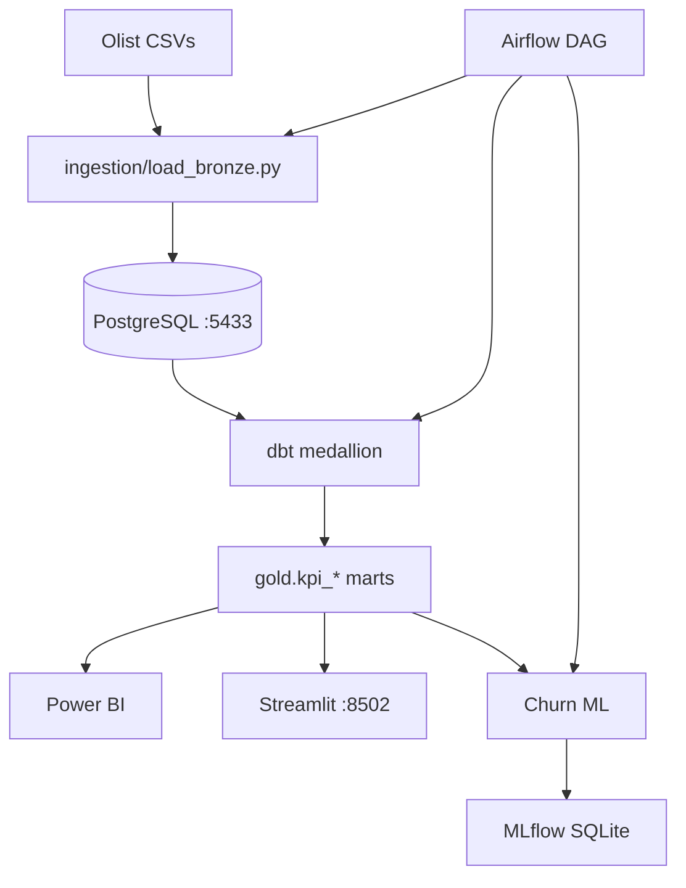
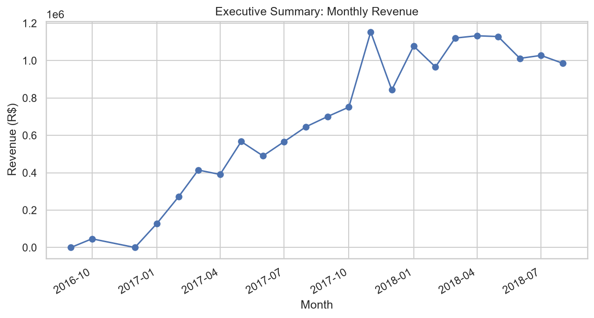
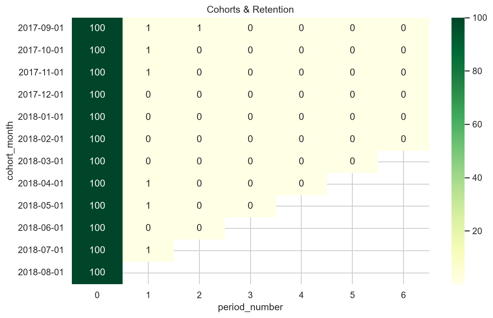
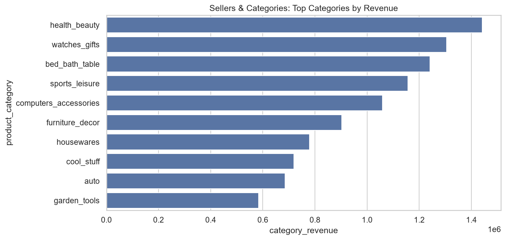
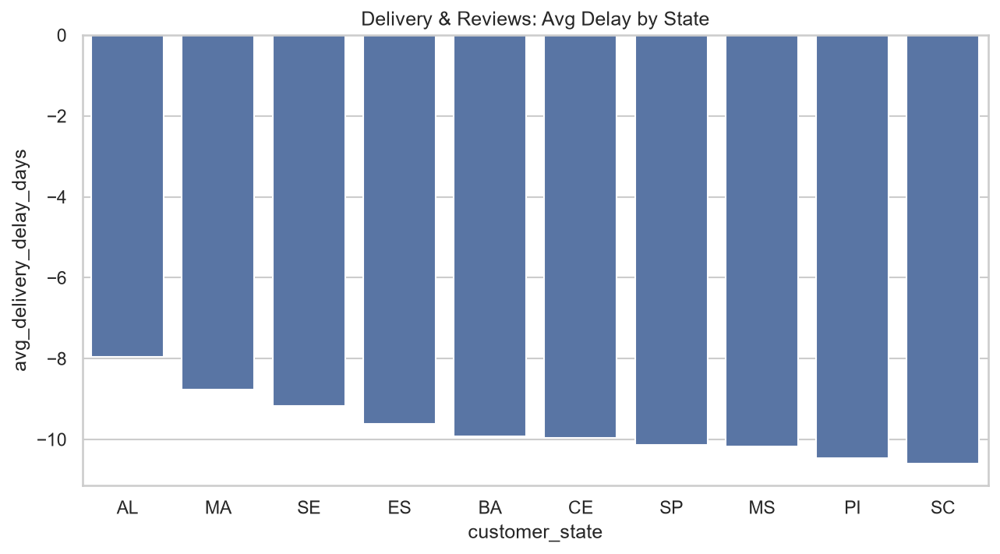

# Olist Analytics Platform

End-to-end **e-commerce revenue & retention analytics** on 100K+ Brazilian marketplace orders (Olist dataset).

[](#stack)

## Architecture



See [docs/architecture.md](docs/architecture.md) for details.

## KPIs

| View | Business question |
|------|-------------------|
| `kpi_monthly_revenue` | Revenue & order growth MoM |
| `kpi_cohort_retention` | Customer reorder rate by acquisition cohort |
| `kpi_churn_rate` | 90-day inactive rate by category/region |
| `kpi_aov` | Average order value trend |
| `kpi_delivery_performance` | Delivery delay by state |
| `kpi_top_sellers` | Top 10% vs long-tail seller concentration |
| `kpi_category_mix` | Revenue by product category |
| `kpi_payment_mix` | Credit card vs boleto share |
| `kpi_review_score` | Review score vs delivery performance |
| `kpi_regional_orders` | Orders & revenue by state |

## Quick start

```bash
# 1. Download Olist CSVs → data/raw/olist/  (see data/raw/olist/README.md)

# 2. Environment
cp .env.example .env

# 3. Start infrastructure
docker compose up -d postgres mlflow

# 4. Python deps
python -m venv .venv && .venv\Scripts\activate   # Windows
pip install -r requirements.txt

# 5. Build dbt Docker image (dbt requires Python ≤3.12; run via Docker)
docker build -t olist-dbt -f dbt/Dockerfile .

# 6. Run full pipeline
python ingestion/load_bronze.py
python scripts/run_dbt.py run
python scripts/run_dbt.py test
python ml/train_churn.py

# 7. Dashboard
streamlit run dashboard/streamlit/app.py
# Or: docker compose up -d streamlit  → http://localhost:8502
```

One-liner: `python scripts/run_pipeline.py`

## Stack

PostgreSQL 16 · dbt 1.8 · Airflow · Power BI · Streamlit · MLflow · scikit-learn · XGBoost

## Sample insights

- **health_beauty** is the top revenue category (9.2%) with **89%** 90-day churn
- Top **10%** of sellers generate **66.8%** of seller revenue
- Cohort retention drops from **100%** (month 0) to **5.5%** (month 1)

Full report: [docs/business_insights.md](docs/business_insights.md)

## Dashboard screenshots

| Executive Summary | Cohort Retention |
|---|---|
|  |  |

| Categories | Delivery & Reviews |
|---|---|
|  |  |

Power BI setup: [dashboard/powerbi/README.md](dashboard/powerbi/README.md)

## ML results

| Model | CV AUC | Precision | Recall | F1 |
|-------|--------|-----------|--------|-----|
| Logistic Regression | 0.67 | 0.94 | 0.62 | 0.75 |
| **XGBoost** | **0.76** | **0.91** | **1.00** | **0.95** |

Churn definition: customer inactive 90+ days after last delivered order. Features: RFM (excl. recency), category, payment mix, delivery/review behavior.

## SQL examples

**Monthly revenue growth:**
```sql
SELECT order_month, total_revenue, revenue_growth_pct
FROM gold.kpi_monthly_revenue
ORDER BY order_month;
```

**Cohort retention:**
```sql
SELECT cohort_month, period_number, retention_pct
FROM gold.kpi_cohort_retention
WHERE period_number <= 6
ORDER BY cohort_month, period_number;
```

More queries in [analytics/sql/](analytics/sql/).

## Project structure

```
├── ingestion/load_bronze.py      # CSV → bronze schema
├── dbt/                          # Bronze/Silver/Gold models + KPI marts
├── airflow/dags/                 # Daily refresh DAG
├── ml/                           # Churn features + training
├── dashboard/streamlit/          # GitHub-friendly demo app
├── dashboard/powerbi/            # Power BI guide + screenshots
├── analytics/sql/                # Standalone KPI queries
└── docs/                         # Architecture, setup, insights
```

## Notes

- PostgreSQL runs on **port 5433** (avoids conflict with local Postgres on 5432)
- dbt runs via **Docker** on Windows when using Python 3.14+
- Raw CSVs are excluded from git — download from [Kaggle](https://www.kaggle.com/datasets/olistbr/brazilian-ecommerce)

## License

MIT — dataset © Olist (Kaggle)
