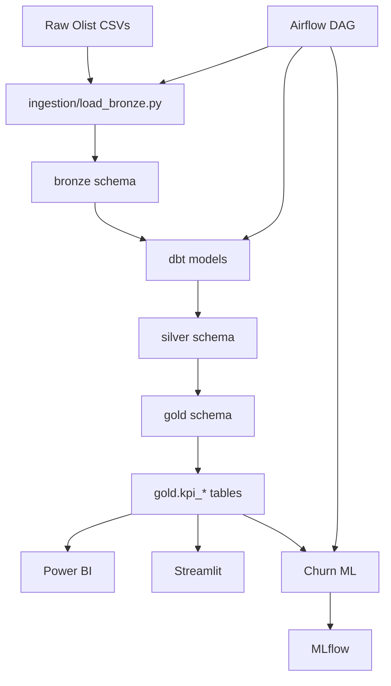

# Olist Analytics Platform — Architecture

## Overview

End-to-end medallion analytics platform for the Olist Brazilian e-commerce dataset (~100K orders).

## Data flow

## Schemas

| Schema | Purpose | Examples |
|--------|---------|----------|
| `bronze` | Raw CSV loads | `customers`, `orders`, `order_items` |
| `silver` | Cleaned joins | `orders_enriched`, `order_items_enriched` |
| `gold` | Analytics marts | `fact_orders`, `kpi_monthly_revenue` |
| `ml` | Feature views | `churn_features` |

## Orchestration

- **Local / dev:** `python scripts/run_pipeline.py` — see [orchestration.md](orchestration.md)
- **Scheduled:** Airflow DAG `olist_daily_refresh` — `docker compose --profile airflow up -d`

## Infrastructure

Docker Compose services:
- **postgres** — warehouse (port 5432)
- **mlflow** — experiment tracking (port 5000)
- **streamlit** — dashboard demo (port 8501)
