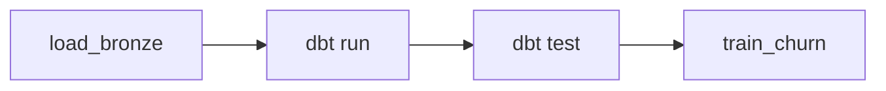

# Orchestration

## Primary orchestrator: `run_pipeline.py`

For local development and demos, use the Python orchestrator:

```bash
python scripts/run_pipeline.py
```

This runs the full DAG in order:



| Step | Script | Notes |
|------|--------|-------|
| 1 | `ingestion/load_bronze.py` | CSV → PostgreSQL bronze |
| 2 | `scripts/run_dbt.py run` | dbt via Docker |
| 3 | `scripts/run_dbt.py test` | 12 data quality tests |
| 4 | `ml/train_churn.py` | XGBoost + MLflow logging |

Individual steps can also be run separately (see [setup.md](setup.md)).

## Airflow (optional — production scheduling)

The same workflow is defined as an Airflow DAG for DE portfolio / production use:

- **DAG file:** [airflow/dags/olist_daily_refresh.py](../airflow/dags/olist_daily_refresh.py)
- **DAG id:** `olist_daily_refresh`
- **Schedule:** `@daily`

### Start Airflow (Docker profile)

```bash
docker compose --profile airflow up -d
# UI: http://localhost:8080  (admin / admin)
```

Airflow mounts the repo at `/opt/olist` and runs the same scripts as `run_pipeline.py`.

### Trigger manually

```bash
docker compose exec airflow airflow dags trigger olist_daily_refresh
```

### When to use which

| Tool | Use case |
|------|----------|
| `run_pipeline.py` | Local dev, CI, quick refresh, Windows-friendly |
| Airflow DAG | Scheduled production runs, DE resume proof, task monitoring |

Both execute the **same task graph** — Airflow adds scheduling, retries, and the web UI.

## Post-pipeline exports

```bash
python scripts/export_powerbi_csvs.py      # Power BI CSVs
python scripts/generate_dashboard_screenshots.py
```
